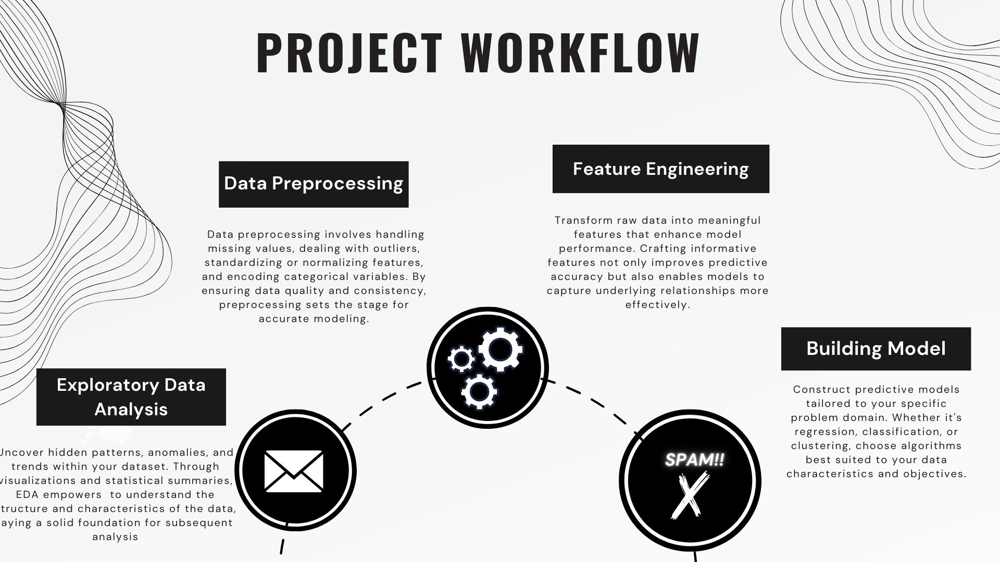
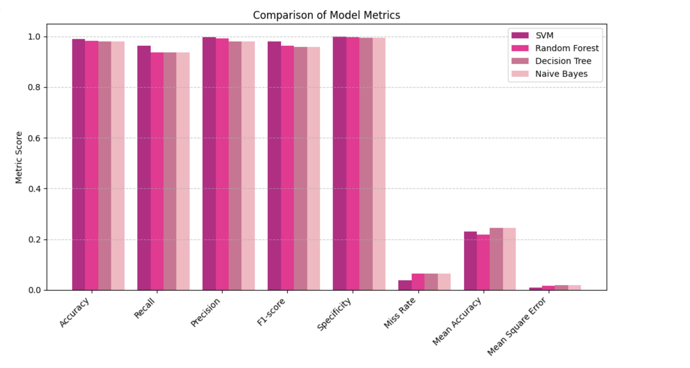

# Email Spam Classifier
 

⭕ **Problem Statement**

With the widespread use of email for communication, the issue of spam emails has become increasingly prevalent. Spam emails not only clutter users' inboxes but also pose security risks by spreading malware, phishing attempts, and fraudulent schemes. To mitigate these risks and improve user experience, there is a need for an efficient and reliable automated system capable of accurately identifying and filtering spam emails.
Develop a machine learning-based system to automatically detect spam emails in a given dataset

⭕ **Objective**

The primary objective of this project is to build a robust spam detection model that can accurately classify emails as spam or legitimate (ham) based on their content.



Figure 1: Workflow *(Image created by author)*

⭕ **Result**

This analysis evaluated four classification models (Naive Bayes, Decision Tree, SVM, and Random Forest) for their performance on a binary classification task. All models achieved high Recall, with SVM achieving the highest (0.9628) followed by Random Forest (0.9368), Naive Bayes and Decision Tree (both at 0.936).

In terms of AUC (Area Under the ROC Curve), SVM again emerged as the leader (0.981), followed by Decision Tree and Random Forest (both at 0.966), and lastly Naive Bayes (0.966).

Figure 2: Model evaluation and comparison * *(Image created by author)*


⭕ **Conclusion**

Based on the evaluation results, SVM classification model appears to be the best performing model overall, achieving the highest accuracy and AUC. However, the differences in performance between the models are relatively small.

# **How to access the code**

🚩  **PREREQUISTIES** 

This is list of required packages and modules for the project to be installed :
* <a href="https://www.python.org/downloads/" target="_blank">Python 3.x</a>
* Pandas 
* Numpy
* Scikit-learn
* NLTK

🚩Install all required packages :
 ```sh
  pip install -r requirements.txt
```

🚩**How to access the code**
<!-- INSTALLATION -->

1. Clone the repo
   ```sh
   git clone https://github.com/BigDataEngineer09/email-spam-classifier-cvip.git
   ```
2. Open 'NLP_Email_spam_Classifier.ipynb' in Google Colab 

⭕-[ Kaggle](https://www.kaggle.com/code/monishashrees/email-spam-filter-99-03)
⭕-[ Linkedin](https://www.linkedin.com/in/monisha-shree-6b8663156/)

